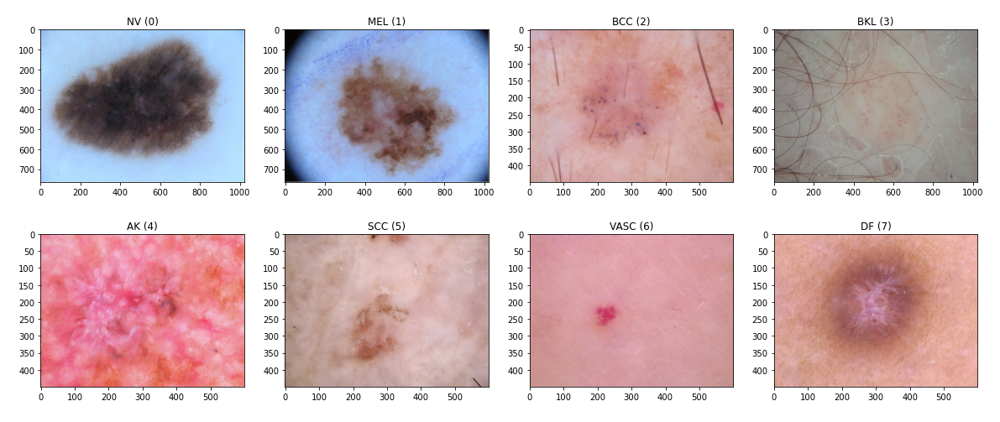
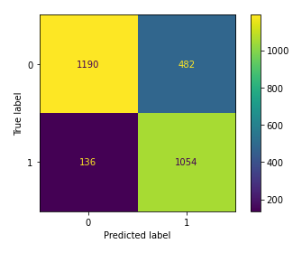
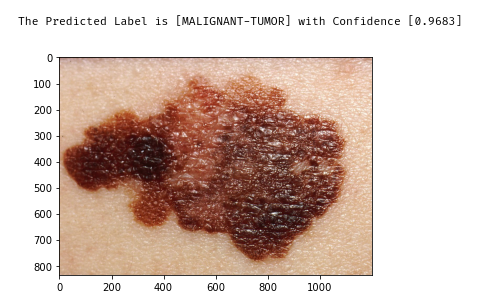

# ISIC-2019-v2 | Skin Tumors Classification

_Personal Machine Learning Project to Practice the Following Skills:_
* Knowledge of Machine Learning concepts
* Knowledge of CNNs
* Knowledge of Pytorch and Torchvision
* Knowledge of Python and Jupyter Notebooks

[](https://www.codefactor.io/repository/github/antonioscardace/ISIC-2019-v2/overview/main)
[](https://github.com/antonioscardace/ISIC-2019-v2/blob/master/LICENSE)

## Introduction

The project aims to analyse and classify skin lesions by their images. The idea comes from the paper named **[Skin Lesion Analysis Toward Melanoma Detection 2018: A Challenge Hosted by the International Skin Imaging Collaboration (ISIC)](https://arxiv.org/abs/1902.03368)**. This dataset contains the training data for the ISIC 2019 challenge.



The dataset has been downloaded from [Kaggle](https://www.kaggle.com/datasets/andrewmvd/isic-2019). It contains **25,331 images** available for the classification of dermoscopic images among 8 different diagnostic categories: 
* Melanocytic nevus _(NV)_ **(50.83%)**
* Melanoma _(MEL)_ **(17.85%)**
* Basal cell carcinoma _(BCC)_ **(13.12%)**
* Benign keratosis (solar lentigo / seborrheic keratosis / lichen planus-like keratosis) _(BKL)_ **(10.36%)**
* Actinic keratosis _(AK)_ **(3.42%)**
* Squamous cell carcinoma _(SCC)_ **(2.48%)**
* Vascular lesion _(VASC)_ **(1.00%)**
* Dermatofibroma _(DF)_ **(0.94%)**

Specifically, I focused my attention just on the tumours' images. Thus, I analysed **19,080 images** among 5 different diagnostic categories among the cited above: 
* Melanocytic nevus _(NV)_ **(55.72%)**
* Melanoma _(MEL)_ **(22.78%)**
* Basal cell carcinoma _(BCC)_ **(17.01%)**
* Squamous cell carcinoma _(SCC)_ **(03.26%)**
* Dermatofibroma _(DF)_ **(01.23%)**

As a first version of the project, I can classify the images as just "**Benign Tumors**" or "**Malignant Tumors**".<br/>
*NV* and *DF* are classified as Benign Tumors. The others are classified as Malignant Tumors.

## Structure

The project structure is designed as follows:

```
.
├── /settings.yml     # It is the configuration file.
├── /data/images/     # The dataset images.
├── /data/raw/        # The original immutable dataset CSV files.
├── /data/interim/    # Intermediate data that has been transformed.
├── /data/processed/  # The final, canonical dataset for training and testing.
├── /src/data/        # Classes to define and work with the dataset.
├── /src/model/       # Classes to define the CNN, train and test the model.
├── /src/utils/       # Classes to help the project development.
├── /models/          # Trained and serialized models' files.
├── /notebooks/       # Notebooks that users use to build the dataset and train/test the model.
└── settings.yml      # Configuration file.
```

## Machine Learning

The Dataset was divided into a Training Set **(85%)**, and a Test Set **(15%)**.<br/>
I did Data Augmentation on the Training Set to improve the model performance.

I implemented a CNN composed of 4 Convolutional Layers and 3 Fully Connected Layers. To reduce the overfitting risk, I used Dropout layers before the first two FC layers. Batch Normalization is also used before each layer, except the last, to accelerate the model convergence.<br/>
To improve the model performance, I had to choose two essential components. As a loss function, I used the Cross-Entropy function. Instead, as an optimizer, I used the Stochastic Gradient Descent (SGD), which is computationally much less expensive than the typical Gradient Descent.

The final model has an accuracy of **78.41%** on the Test Set.<br/>
Anyway, the most significant class, Malignant Tumors, is the most precise (**88.57%**).



## Demo Example



## Getting Started

So that the repository is successfully cloned and the project runs smoothly, a few steps need to be followed.

### Requisites

* A good amount of cores (GPU is better) and RAM.
* Free disk space (> 10GB) is required.
* ``anaconda``, ``pytorch``, and ``torchvision`` are required.

### Installation and Use

```sh
   $ git clone https://github.com/antonioscardace/ISIC-2019-v2.git
   $ cd YOUR_PATH/ISIC-2019-v2/
   $ mkdir models
``` 

Now download the dataset from [Kaggle](https://www.kaggle.com/datasets/andrewmvd/isic-2019) and put images in [/data/images/](/data/images/). <br/>
Then, you can use any notebook in [/notebooks/](/notebooks/).

## Credits

Author: [Antonio Scardace](https://linktr.ee/antonioscardace).<br/>
You can find them in [/docs/credits.txt](/docs/credits.txt).
